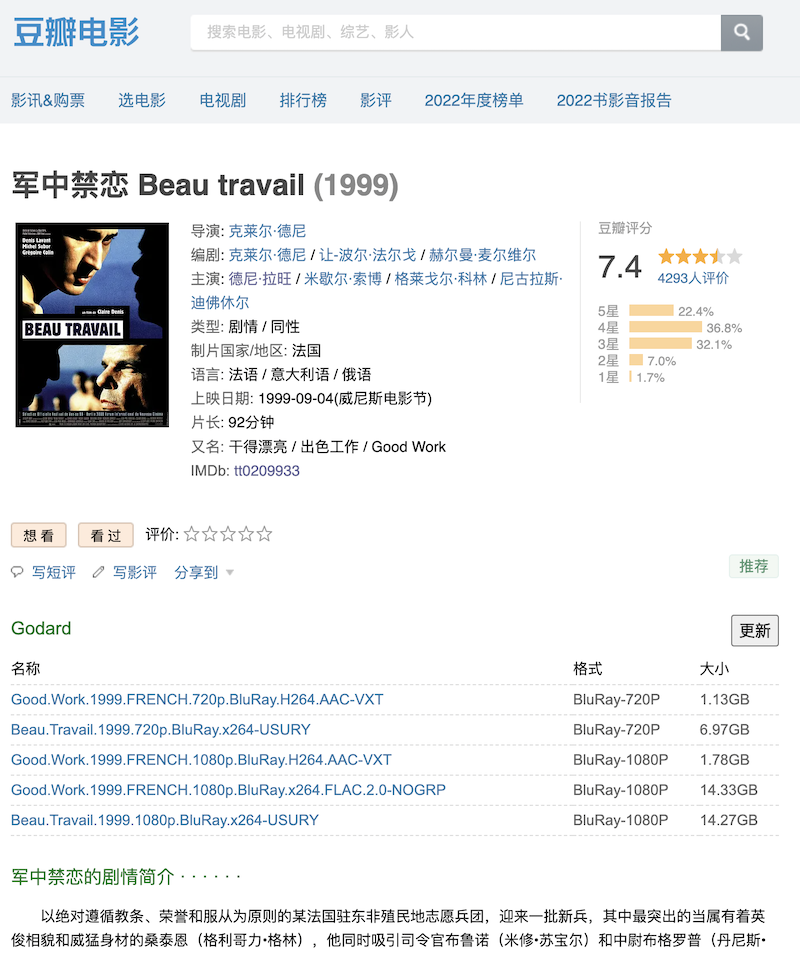
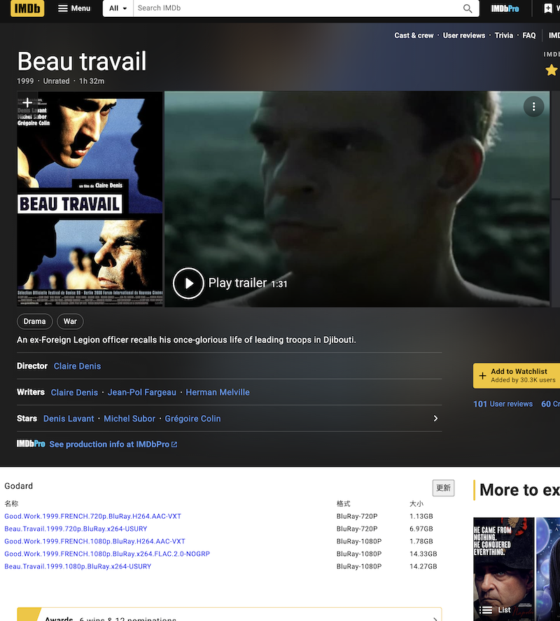

# Godard
douban imdb movie information helper

### How to run
    unzip godard.db.zip
    run ./godard (on your server build your api service)
    proxy your nginx/caddy to :8888
    edit chrome-extension/js/douban.js to change the APIURL then install

### 1 more thing

Add a token to protect your api
